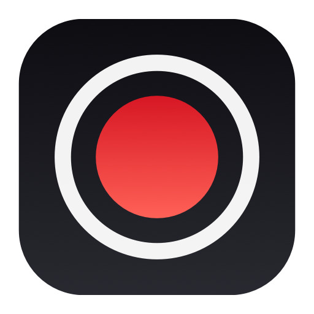

#  Recordly

A minimal screen recorder for macOS. It lives in the menu bar and records your screen, a floating camera bubble, and your microphone into a single `.mov` file.

## Features

- **Start / Stop Recording** from the menu bar (3-second countdown before recording starts).
- **Camera bubble**: a circular, draggable webcam overlay that is captured in the recording. Toggle it on/off at any time.
- **Microphone**: records the default input device. Toggle mute at any time, even mid-recording.
- Records the display the mouse pointer is on, at native resolution (capped at 4K), 30 fps, H.264 + AAC.
- Recordings are saved to `~/Movies/Recordly/` and revealed in Finder when you stop.

## Quick start

```sh
git clone https://github.com/madhu-garudala/ScreenRecord_Video_Devin.git
cd ScreenRecord_Video_Devin
make run
```

> [!IMPORTANT]
> **Recordly is a menu bar app — no window opens when you launch it.** Look for `◯ Recordly` in the top-right menu bar (leftmost item of the status icon cluster). Click it for the menu.

First launch asks macOS for permissions — grant them and relaunch:

1. **Screen Recording**: System Settings → Privacy & Security → Screen Recording → enable Recordly → quit and relaunch.
2. **Camera** and **Microphone**: prompted automatically the first time they're used.

## Requirements

- macOS 14 (Sonoma) or later
- Xcode 15+ or the Swift 5.9+ command line tools (`xcode-select --install`)

## Make targets

| Target | What it does |
| --- | --- |
| `make run` | Builds `build/Recordly.app` and opens it |
| `make app` | Builds only |
| `make install` | Copies the app to `/Applications` (launch from Spotlight, add to Login Items) |
| `make dist` | Creates `dist/Recordly.zip` for sharing |
| `make icons` | Regenerates app icon + brand assets from `scripts/render-icons.swift` |
| `make clean` | Removes `.build`, `build`, `dist` |

Always launch via `open build/Recordly.app` (or Finder/Spotlight), not by running the binary directly — otherwise macOS attributes the camera, microphone, and screen recording permissions to your terminal instead of Recordly.

## Troubleshooting

**"I launched it and nothing happened."**
No window is supposed to open. The app is the `◯ Recordly` item in the menu bar, top-right of the screen. If your menu bar is crowded, the item may be hidden — macOS Tahoe manages this in System Settings → Menu Bar → "Allow in the Menu Bar".

**"Start Recording" shows a permission message.**
Enable Recordly under System Settings → Privacy & Security → Screen Recording, then quit and relaunch. The app is ad-hoc signed, so macOS may ask again after each rebuild — if recording silently fails, remove Recordly from the Screen Recording list and add it back.

**"Recording stopped unexpectedly" / no file appears.**
Check `~/Movies/Recordly/` and the menu's status message. Screen Recording permission is the usual cause.

## Share it with other Macs

`make dist` produces `dist/Recordly.zip`. Send the zip to another Mac, unzip it, move `Recordly.app` to Applications, and do a one-time Gatekeeper bypass (the app is ad-hoc signed):

```sh
xattr -dr com.apple.quarantine Recordly.app
```

or right-click → **Open** → **Open Anyway**.

The same zip is produced automatically by the **Build** workflow on GitHub Actions (Artifacts → `Recordly`).

For zero-warning distribution, sign with an Apple **Developer ID** certificate (paid Apple Developer Program) and notarize:

```sh
SIGN_IDENTITY="Developer ID Application: Your Name (TEAMID)" make app
```

## Project layout

```
Package.swift                         Swift package (single executable target)
App/Info.plist                        App bundle metadata + privacy usage strings
App/Recordly.iconset/                 App icon source images (all sizes)
App/Branding/                         Icon variants + wordmark
scripts/build-app.sh                  Builds and ad-hoc signs build/Recordly.app
scripts/render-icons.swift            Regenerates icon/brand assets (make icons)
Sources/Recordly/
  RecordlyApp.swift                   Menu bar UI
  RecorderController.swift            Recording state, permissions, countdown, file naming
  ScreenRecorder.swift                ScreenCaptureKit + microphone → AVAssetWriter
  CameraOverlayController.swift       Floating circular camera bubble
  Permissions.swift                   Camera / mic / screen permission helpers
```

## Roadmap

- Upload finished recordings to Google Drive and copy a share link.

## License

MIT — see [LICENSE](LICENSE).
